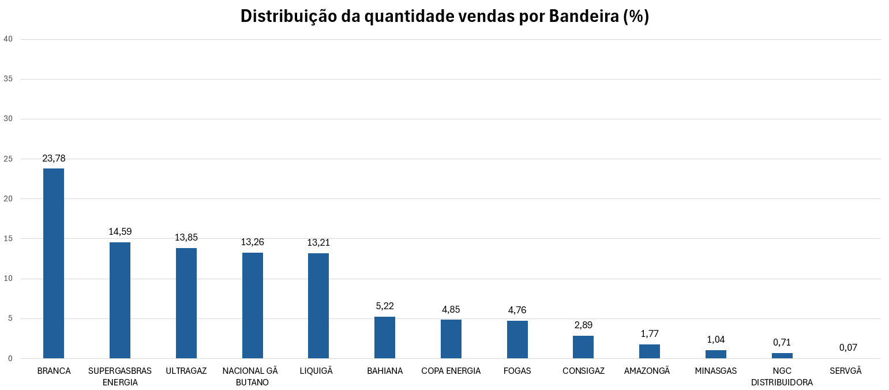
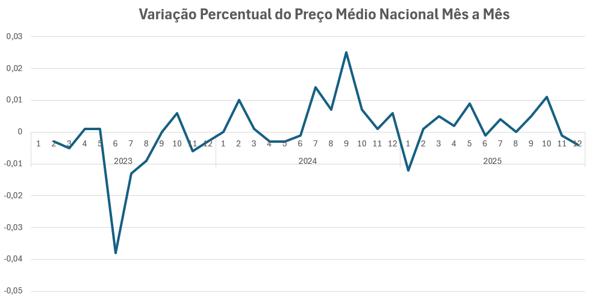
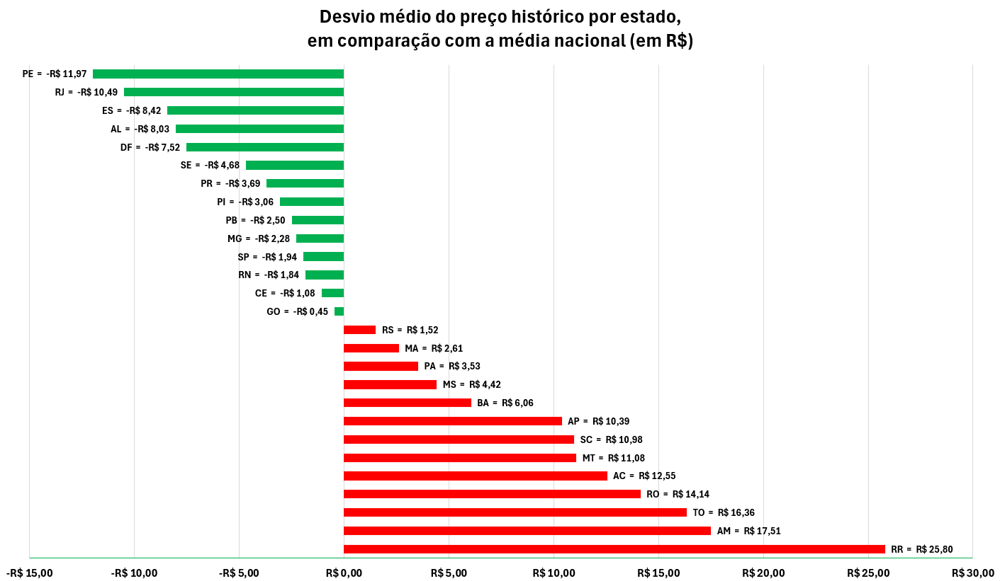

# Análise da variação do preço do GLP no Brasil (2023-2025)

## Contexto
Com o fim da pandemia, da necessidade de se realizar um *lockdown* e a entrada de um novo governo, além da piora das relações internacionais entre diversos países produtores de petróleo, foi possível notar que os preços de diversos produtos derivados do petróleo aumentaram de maneira extrema e assustadora. Através deste estudo, estarei buscando os principais fatores responsáveis por meio de uma análise estatística utilizando bases de dados disponíveis publicamente em sites governamentais do Brasil.

---
### 1. Entendimento do Negócio
**Objetivo**

Analisar a variação histórica do preço do gás liquefeito de petróleo (GLP) no período entre 2023 a 2025. Entender como o cenário político tanto nacional quanto internacional afetaram a variabilidade do preço deste recurso. Para isso, busquei responder as seguintes perguntas:
- Qual foi o preço médio do GLP em cada mês por estado?
- Qual foi a variação do preço médio de cada estado em comparação com a média nacional, num mesmo período de tempo?
- Qual foi o preço médio total do GLP por bandeira?
- Das bandeiras com presença significativa (+20k de medidas), qual foi o preço médio de cada uma por mês?
- Qual foi a variação percentual do preço médio nacional, mês a mês?
- Como é o ranking dos estados onde o preço médio foi maior que a média nacional?
- Qual o desvio médio total do preço em cada estado comparado à média nacional?
---
### 2. Entendimento dos Dados
**Descrição e Coleta**

Os dados foram coletados a partir de bases disponibilizadas pelo governo brasileiro no site [dados.gov.br](https://dados.gov.br/home) e baixados diretamente no formato de arquivo **.CSV**. Para melhor entendimento dos dados que serão utilizados, segue sua descrição (metadados): 

| Metadados      |                                                                                                                                                                                                                            |
| -------------- | -------------------------------------------------------------------------------------------------------------------------------------------------------------------------------------------------------------------------- |  
| Descrição:     | Série Histórica de Preços de Combustíveis, com base na pesquisa de preços da Agência Nacional do Petróleo, Gás Natural e Biocombustíveis, no formato de dados abertos                                                      |
| Título:        | Série Histórica de Preços de Combustíveis                                                                                                                                                                                  |
| Origem:        | https://www.gov.br/anp/pt-br/centrais-de-conteudo/dados-abertos/serie-historica-de-precos-de-combustiveis                                                                                                                  |
| Fonte:         | ANP/SDC (Superintendência de Defesa da Concorrência)                                                                                                                                                                       |
| Formato:       | CSV                                                                                                                                                                                                                        |
| Periodicidade: | Semanal, mensal e semestral.                                                                                                                                                                                               |
| Notas:         | Dados obtidos por meio de pesquisa de preços (Levantamento de Preços de Combustíveis - LPC), realizada semanalmente por empresa contratada. A pesquisa abrange gasolina C, etanol hidratado, óleo diesel B, GNV e GLP P13. |
| Contato:       | sdc@anp.gov.br                                                                                                                                                                                                             |


| Campos da Tabela  | Descrição                                                                                                                                                                                                                                                                                                                                         | Tipo         |
| ----------------- | ------------------------------------------------------------------------------------------------------------------------------------------------------------------------------------------------------------------------------------------------------------------------------------------------------------------------------------------------- | ------------ |
| Regiao - Sigla    | Sigla da Região da revenda pesquisada                                                                                                                                                                                                                                                                                                             | alfanumérico |
| Estado - Sigla    | Sigla da Unidade Federativa (UF) da revenda pesquisada                                                                                                                                                                                                                                                                                            | alfanumérico |
| Municipio         | Nome do município da revenda pesquisada                                                                                                                                                                                                                                                                                                           | alfanumérico |
| Revenda           | Nome da revenda pesquisada                                                                                                                                                                                                                                                                                                                        | alfanumérico |
| CNPJ da Revenda   | Número do Cadastro Nacional de Pessoa Jurídica da revenda pesquisada                                                                                                                                                                                                                                                                              | numérico     |
| Nome da Rua       | Nome do logradouro da revenda pesquisada                                                                                                                                                                                                                                                                                                          | alfanumérico |
| Numero Rua        | Número do logradouro da revenda pesquisada                                                                                                                                                                                                                                                                                                        | alfanumérico |
| Complemento       | Complemento do logradouro da revenda pesquisada                                                                                                                                                                                                                                                                                                   | alfanumérico |
| Bairro            | Nome do bairro da revenda pesquisada                                                                                                                                                                                                                                                                                                              | alfanumérico |
| Cep               | Número do Código do Endereço Postal (CEP) do logradouro da revenda pesquisada                                                                                                                                                                                                                                                                     | alfanumérico |
| Produto           | Nome do combustível pesquisado                                                                                                                                                                                                                                                                                                                    | alfanumérico |
| Data da Coleta    | Data da coleta do(s) preço(s)                                                                                                                                                                                                                                                                                                                     | data         |
| Valor de Venda    | Preço de venda ao consumidor final praticado pelo revendedor, na data da coleta                                                                                                                                                                                                                                                                   | numérico     |
| Valor de Compra   | Preço de distribuição (preço de venda da distribuidora para o posto revendedor de combustível) * Série disponível até agosto de 2020                                                                                                                                                                                                              | numérico     |
| Unidade de Medida | Unidade de Medida                                                                                                                                                                                                                                                                                                                                 | numérico     |
| Bandeira          | Noma da Bandeira da revenda. O Posto bandeirado é aquele que opta por exibir a marca comercial de um distribuidor, o posto deverá vender somente combustíveis fornecidos pelo distribuidor detentor da marca comercial exibida aos consumidores. Já o Posto bandeira branca é o que opta por não exibir marca comercial de nenhuma distribuidora. | alfanumérico |

**Análise Exploratória e Sanity Check/Tratamento**

Para garantir a integridade e veracidade dos dados, eles foram tratados da seguinte maneira:
- Análise visual do arquivo CSV para garantir formatação, consistência e qualidade dos dados.
- Checagem de valores nulos e número de linhas em cada coluna.
- De acordo com os metadados, não há preenchimento da coluna 'Valor de Compra' após o ano de 2020 e portanto, como esta análise parte do ano de 2023, ela foi excluída.
- Transformação da coluna 'Data da Coleta' para o tipo *datetime64{us}* e da coluna 'Valor de Venda' para *float64*, pois a biblioteca Pandas atribuiu erroneamente o tipo *str* a elas.
---
### 3. Tecnologias utilizadas
Para a realização desse projeto, foram utilizadas três ferramentas principais. São elas:
- **PostgreSQL:** banco de dados escolhido devido sua facilidade de uso e integração com o Python e VSCode através de bibliotecas e extensões. Isso permitiu o uso de todas as ferramentas em um único ambiente de desenvolvimento.
- **Python:** linguagem de programação famosa pelo seu uso em análise de dados e machine learning. Possui diversas bibliotecas para auxiliar no tratamento e visualização de dados.
- **Excel:** ferramenta conhecida pela sua facilidade de uso e versatilidade, possibilitando a construção de gráficos e tabelas para auxiliar em análises.
---
### 4. Estrutura do Repositório
O projeto foi estruturado de maneira a facilitar seu uso e entendimento, para que qualquer um que desejar possa reproduzi-lo localmente em sua máquina. As pastas foram organizadas no seguinte formato:
```
glp-analysis/
│
|
├── assets/           ← imagens .png usadas no README
|
|
├── data/
│   ├── raw/          ← CSVs originais da ANP 
│   └── processed/    ← arquivos que passaram pelo tratamento inicial
|   └── final/        ← dados processados que foram consolidados num     
|                       único arquivo 
|   └── results/      ← resultado das queries salvos em arquivos .csv
│
├── scripts/
│   └── tratamento.ipynb ← notebook onde os datasets foram inicialmente  
|                          tratados
|   └── sanity_check.ipynb ← onde os datasets foram checados pós         
|                            tratamento para identificar falhas ocultas
|   └── importar_dados.ipynb ← notebook para preencher o banco de dados
│
|   └── exportar_resultados.ipynb ← usado para transformar o resultado de 
|                                   queries em arquivos CSV
|
├── queries/
│   ├── exports/        ← queries cujos resultados serão transformados em 
|                         arquivos CSV e analisados com Excel
|   └── sandbox/        ← testes e refinamento de queries
|   └── 01_setup.sql    ← query para criar o esquema e tabela principal
│
├── .gitignore
├── pyproject.toml      ← arquivo com as dependências necessárias do     
|                         projeto
├── poetry.lock         ← arquivo contendo especificações de cada        
|                         dependência
└── README.md
```
---
### 5. Principais achados
Me guiando pelas perguntas de negócio e seus resultados, pude chegar às seguintes conclusões quanto ao comportamento do preço do GLP durante os anos de 2023 até 2025:

**Importância da região Sudeste**

Os dados desse período somam ao todo cerca de 512 mil linhas, sendo que o Sudeste apenas seja responsável por 42,25% (≈216k linhas) do volume total. Ainda, metade disso é só de São Paulo, que aparece em 22% de todas as amostras, seguido por Minas Gerais (≈11%). Ou seja, dois estados compõem aproximadamente 33% da base de dados. 

**Falta de representatividade ou monopólio?**

De todas as vendas registradas, 23% são de produtos sem bandeira (conhecido como bandeira branca), com um preço médio menor que os de marca. As bandeiras Supergasbras Energia (14,5%), Ultragaz (13,8%), Nacional Gás Butano (13,3%) e Liquigás (13,2%) seguem na liderança e, junto dos sem bandeira, formam o Top 5. 
É possível perceber que quatro empresas juntas dominam o mercado, com quase 55% de todas as vendas. Não incluindo produtos sem bandeira, os 22% restantes são distribuídos entre 8 marcas, onde as menores variam de 0,07 até 1,8%.

É possível que essa diferença se deve à área de atuação de cada empresa. As que disponibilizam seus serviços em grandes centros urbanos e regiões de alta densidade populacional vão, provavelmente, vender mais que outras na situação contrária. Também deve-se lembrar que a amostragem foi feita de tal forma que o Sudeste aparece com muito mais frequência, podendo causar um viés de localização nos resultados.



**O mercado demonstra uma tendência no seu comportamento**

Um padrão curioso que percebi foi que, a variação do preço médio nacional em relação ao mês anterior tende a diminuir nos meses de Dezembro e Janeiro, aumentar de Fevereiro até Maio e diminuir novamente em Junho e Julho. Esse comportamento, que lembra uma onda, indica uma possível reação atrasada a eventos que influenciam o preço do GLP ou sazonalidade natural. Um exemplo interessante é que em Fevereiro de 2024 o ICMS do GLP aumentou mas o preço médio só começou a diminuir a partir de Abril e, em Fevereiro de 2025 o ICMS diminuiu mas o preço continuou aumentando até Junho.
Entretanto, é necessário se atentar ao tentar conectar um evento com uma medida. Infinitas variáveis se interconectam para influenciar o preço de um produto, desde mudanças em leis locais, variação no valor do Dólar e do petróleo internacional, até conflitos geopolíticos como guerras e sanções econômicas entre potências mundiais.



**A importância da geografia na economia brasileira**

Se criarmos um ranking dos estados com mais meses onde o preço médio foi maior que a média nacional, podemos notar um fato importante: aqueles no top 10 tiveram um preço mais caro em todos os meses analisados e, tirando Santa Catarina, Bahia e Mato Grosso, todos são da região Norte. Apesar do estado do Pará ter sido o único deles que não ficou entre os dez primeiros, ele segue bem perto estando empatado com Mato Grosso do Sul na 11ª colocação com 94,44% dos meses observados tendo um preço mais alto.

Já se analisarmos na direção contrária, sete estados estavam mais baratos durante todo o período e, com exceção do Distrito Federal, todos possuem acesso ao Oceano Atlântico. Isso, em combinação com a observação anterior, pode indicar que fatores como distância das plataformas de petróleo e refinarias influenciam significativamente no preço do GLP. Conforme nos afastamos da costa brasileira e adentramos o continente sul americano, podemos notar um encarecimento dos produtos. 

Além disso, o isolamento do Norte em relação aos principais centros econômicos do país e a falta de infraestrutura e investimento podem exacerbar ainda mais uma disparidade no valor não somente do combustível, como também de todos os produtos que precisam ser transportados de uma ponta do país até outra.

Para os demais estados que fogem dessa regra, suponho que fatores políticos e socioeconômicos exercem uma força maior. Legislações, impostos estaduais, falta de investimento e interesse de certos grupos podem acabar por encarecer ou desestabilizar a média dos preços.

Corroborando também esta análise é o fato de que, o ranking do desvio médio histórico do preço por estado segue quase que exatamente o mesmo ranking da quantidade de meses onde o preço médio foi maior que a média nacional.



---
### 6. Limitações e observações
Devido à natureza dos dados trabalhados, é impossível discernir uma causa única e exata que possa explicar seu comportamento. Quando se trata de uma análise de mercado, independente do setor, é importante destacar que diversos eventos podem contribuir para uma mudança. Na grande maioria das vezes é uma combinação de fatores e efeitos dominó desencadeando uma reação que pode afetar áreas completamente diferentes.

Tendo isso em mente, esta análise busca levantar hipóteses que possibilitam uma melhor compreensão do cenário de venda de derivados do petróleo, mais especificamente do GLP.
Dada a oportunidade e com acesso a diversas fontes dos mais variados tipos de dados, seria possível uma análise mais aprofundada, interligando causas e efeitos diretamente.

---
### 7. Como reproduzir

Caso tenha interesse, é possível reproduzir os resultados obtidos da seguinte maneira:  
*Atenção: este projeto utiliza o Poetry como gerenciador de dependências.*

**Criar ambiente virtual** 

``python -m venv .venv``

**Instalar Poetry (caso não tenha)**

``pip install poetry``

**Instalar dependências**

``poetry install --no-root``

**Ativar ambiente virtual**

cmd: 
``.venv\Scripts\activate.bat``

powershell: 
``.venv\Scripts\Activate.ps1``

**definir as variáveis de ambiente contendo as informações do seu banco de dados**
- crie um arquivo .env contendo as seguintes informações:
	- DB_USER
	- DB_PASSWORD
	- DB_HOST
	- DB_PORT
	- DB_NAME

**rodar os notebooks jupyter na seguinte ordem**
1. sanity_check.ipynb
2. importar_dados.ipynb
3. exportar_resultados.ipynb

Os arquivos .csv contendo o resultado das queries podem ser encontrados na pasta data/results